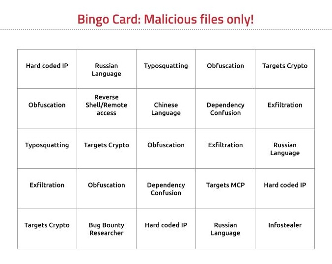

# DEFCON33 Workshop - Open Source Malware 101

## Everything you always wanted to know about NPM malware (and more)

[Hacker Tracker Link](https://hackertracker.app/event/?conf=DEFCON33&event=61720)

- Workshop location: LVCC North Hall L2 N254
- Workshop time: 9am - 1pm

### Created by [6mile](https://github.com/6mile/)

Thanks so much for signing up for this workshop!  I am very excited to be doing this at DEF CON 33!
I have created this repository so we can use this as a central source of information for this workshop.

This 4 hour DEF CON Workshop is a cut down version of a two day class that I'm doing.  As such, there is a lot of content and we probably won't get to all of it in 4 hours.  

### Description of the Workshop

This hands-on workshop will teach both software engineers, and infosec practitioners how NPM malware works. We’ll learn what makes NPM malware unique from other software package malware, and how the author has been using his knowledge of NPM malware in his research, and to deliver unique offensive security engagements. Most importantly how to identify, analyze, create and defend against malicious NPM packages in this workshop.

### Workshop requirements

This workshop will be performing many research related tasks that are probably best done in a Linux or MacOS environment.  If you have a Windows box, please make sure you have some local Linux environment handy.  I typically use Ubuntu (unfortunately) but I'll leave that up to the attendees to decide.  I can help for MacOS or Ubuntu, but you're gonna be on your own if you bring another OS. Using an Ec2 instance or VM in Vultr is also a great way to create a lab environment.

#### NPM & GitHub accounts

You should have pre-existing GitHub and NPM accounts.  One of the exercises will be to create a "code puppet" NPM account.

### Workshop Content

The 4-hour workshop will cover:

- Intro to 6mile
- Types of software risk: accidental vs malicious 
- Contest rules
- Definition of malicious
- Why is Javascript malware different?
- Where do you find open-source malware?
  - Create a new NPM account - EXERCISE
- How does open-source malware evade security tools?
  - SCA not built for malware - EXERCISE
  - SAST doesn’t help either
- Find some malware - EXERCISE
- TVPO:  How do we threat model?
- Open-source malware TTP’s
  - Dependency Confusion - EXERCISE
  - AI slop
  - Typosquatting - EXERCISE
  - Targeting maintainers - EXERCISE
- Open-source malware archetypes
  - Analysing new malware - EXERCISE
- Threat actor profiles
- Building NPM malware - EXERCISE
  - Creating your own malicious package on NPM
  - Obfuscation
  - Increasing package downloads
- How to be better going forward
- Resources

## Open-Source Bingo

We will play bingo during the workshop.  The bingo card has descriptions of open source malware components.  Examples are dependency confusion, typosquatting, and exfiltration.  As you are researching malicious packages during the workshop you will find examples of malicious package components on the bingo card.  The first person to match five in a row wins!

## Workshop Tools

## Malware Samples -- ALERT:  THESE ARE REAL LIVE JAVASCRIPT MALWARE FILES

Please see the [malware](https://github.com/6mile/DEFCON33-Workshop/malware)  directory in the repository.

### Open-Source Malware Archetypes

- Reverse shell and remote access
- Exfil variables or data
- Crypto miners
- Crypto drainers
- Infostealers
- Ransomware

### Additional Resources

- https://github.com/advisories?query=type%3Amalware
- https://osv.dev/list
- https://github.com/lxyeternal/pypi_malregistry/
- https://github.com/DataDog/malicious-software-packages-dataset/
- https://x.com/NPM_malware
- https://github.com/tstromberg/supplychain-attack-data
- https://dasfreak.github.io/Backstabbers-Knife-Collection/
- https://intel.aikido.dev/
- https://vetpkg.dev/mal

